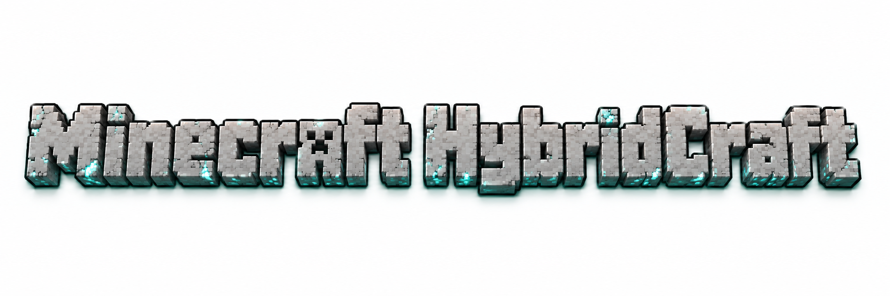

<div align="center">
<p>English | <a href="README_zh-CN.md">简体中文</a></p>

<h1>HybridCraft</h1>
<p><strong>Minecraft Hybrid World</strong></p>
<p>Familiar creatures. Unexpected combinations. A new world to discover.</p>
<p>
<code>Minecraft 26.1.2</code> <code>Fabric 0.19.3</code> <code>Java 25</code><br>
<code>HybridCraft 1.0.0-rc.1</code> <code>MIT License</code>
</p>
<p><a href="#download-and-installation">Get the RC &amp; install</a> · <a href="#hybriddex">Explore the in-game HybridDex</a> · <a href="CHANGELOG.md">Changelog</a></p>
</div>

HybridCraft is a **Minecraft Java Edition Fabric mod** that combines the appearance, movement, attacks and special abilities of familiar mobs into new creatures. Explore **100+ Hybrid Creatures — 102 entries, H-001–H-102** — across a world shaped by regional encounters, discovery and DNA fusion.

**Publication status:** The tested v1.0.0 Release Candidate is available here as **HybridCraft-1.0.0.jar**. Its internal version remains **1.0.0-rc.1+mc26.1.2**. No GitHub Release or tag has been created.

## Core features

- **🧬 100+ Hybrid Creatures** — Recognizable parent traits form distinct silhouettes and combat styles, from climbing archers to flying explosives.
- **🌍 Hybrid World Ecosystem** — Biome, dimension, rarity and world Hybrid Level influence natural encounters. Vanilla mobs remain part of the world.
- **⚔ Hybrid Ability System** — Reusable abilities combine climbing, flight, teleportation, projectiles, charges and more, with cooldowns and limits.
- **📖 HybridDex** — Discover creatures, track personal progress, and browse their parents, abilities, drops and habitats with search, categories and sorting.
- **🧪 DNA Fusion System** — Collect DNA and use defined parent combinations to create specific Hybrids through 102 fusion recipes.
- **🔬 Hybrid Laboratory** — Combine two DNA samples and a catalyst in a dedicated interface that displays fusion progress and results.

## How the hybrid world works

| Parents | Hybrid |
|---|---|
| Skeleton + Spider | H-001 Skeleton Spider |
| Bee + Creeper | H-006 Explosive Bee |
| Enderman + Shulker | H-019 Ender Shell |

Explore → encounter a Hybrid → unlock its HybridDex entry → collect DNA → attempt a fusion.

Hybrids also appear naturally. A chance-based mutation system acts on eligible vanilla hostile-mob spawns, using biome and dimension rules while preserving vanilla spawn limits. The Overworld, Nether and End have different encounter pools; rivers and oceans support aquatic Hybrids. Rare and legendary creatures have restricted, low-probability spawning.

## Featured Hybrids

| Hybrid | Parents | Core abilities |
|---|---|---|
| H-001 Skeleton Spider | Skeleton + Spider | Wall climbing, arrows, keeping distance |
| H-004 Blaze Spider | Spider + Blaze | Wall climbing, fireballs, fire immunity |
| H-006 Explosive Bee | Bee + Creeper | Flight, fuse explosion |
| H-007 Drowned Guardian | Drowned + Guardian | Swimming, charged laser, melee |
| H-018 Floating Shulker Beast | Phantom + Shulker | Flight, homing projectiles, brief levitation |
| H-026 Ancient Iron Beast | Iron Golem + Ravager | Heavy melee, warned charge, knockback |
| H-097 Abyssal Sovereign | Warden + Elder Guardian | Swimming, sonic blast and laser, defensive resistance |
| H-100 Sculkwing Sovereign | Warden + Ender Dragon | Flight, sonic blast and laser, brief darkness |

## Screenshots

Real Minecraft captures from the current RC. Creature scenes were staged in a separate test world; combat effects come from the existing AI. The aquatic scene illustrates a habitat rather than a natural encounter. Both language editions use the same images; the interface captures below are in English.

<table>
<tr>
<td width="50%"><br><strong>Skeleton Spider</strong> — skeleton anatomy on a spider body.</td>
<td width="50%"><br><strong>Blaze Spider</strong> — a fireball in flight.</td>
</tr>
<tr>
<td width="50%"><br><strong>Abyssal Sovereign</strong> — an aquatic habitat showcase.</td>
<td width="50%"><br><strong>Sculkwing Sovereign</strong> — a sonic attack in the End.</td>
</tr>
<tr>
<td width="50%"><br><strong>HybridDex</strong> — discovery, categories and creature details.</td>
<td width="50%"><br><strong>Hybrid Laboratory</strong> — a completed DNA fusion.</td>
</tr>
</table>

## HybridDex

**Open the full in-game HybridDex with H.**

The in-game HybridDex covers **102 entries, H-001–H-102**, with parents, abilities, drops, habitats and fusion recipes. Discover creatures to reveal their records. The standalone documentation and full screenshot library are not included in this compact distribution repository.

In game, press **H** by default to open your personal HybridDex. Discover entries by approaching visible Hybrids, then search, filter and sort your records. The interface supports English and Simplified Chinese.

## DNA fusion

Vanilla mobs → DNA samples → two parent DNA types + Hybrid Catalyst → Hybrid Laboratory → Hybrid creature.

1. Collect DNA from eligible vanilla-mob drops and choose a pairing from the HybridDex.
2. Place the two parent DNA samples and one Hybrid Catalyst into the laboratory, then start fusion. DNA slot order does not matter.
3. Keep the initiating player's laboratory interface open while the process runs. Current recipes take **600 active ticks (30 seconds at normal TPS)** and have a **90% success rate**.

Leave suitable space around the laboratory: ground for land creatures, air for flyers and sufficient water for aquatic results. A blocked placement preserves the completed result for a later retry. Fused creatures retain their hostile behavior.

## Download and installation

Download the tested build from this repository. The public filename is `HybridCraft-1.0.0.jar`; its internal version remains `1.0.0-rc.1+mc26.1.2`. Renaming the file does not change its contents.

- **[Download HybridCraft-1.0.0.jar](HybridCraft-1.0.0.jar?raw=true)**
- [Fabric Loader installer](https://fabricmc.net/use/installer/)
- [Fabric API downloads](https://modrinth.com/mod/fabric-api) — select **0.155.3+26.1.2**.

Fabric Loader and Fabric API must be installed separately. No launcher, Minecraft instance or other mod is bundled here. A GitHub Release and tag will follow after repository review.

1. Create a **Minecraft Java Edition 26.1.2** instance using **Java 25**.
2. Install **Fabric Loader 0.19.3** for that instance.
3. Put **Fabric API 0.155.3+26.1.2** in the instance's `mods` folder.
4. Add the HybridCraft RC JAR to the same folder. Keep one HybridCraft version installed; use the playable JAR rather than a sources JAR.
5. Launch Minecraft. Explore on a non-Peaceful difficulty, or use spawn eggs in Creative mode to inspect the creatures.

Use any compatible Fabric launcher, including PCL. With instance isolation enabled, use that instance's own `mods` folder. For multiplayer, install HybridCraft and Fabric API on both the client and server.

## Requirements

| Component | Current build target |
|---|---|
| Minecraft Java Edition | 26.1.2 |
| Fabric Loader | 0.19.3 |
| Fabric API | 0.155.3+26.1.2 |
| Java | 25 |
| HybridCraft | 1.0.0-rc.1 |

The packaged mod version is `1.0.0-rc.1+mc26.1.2`. Minecraft compatibility is scoped to **26.1.2**; later game versions require separate testing.

## Development roadmap

| Stage | Milestone | Status |
|---|---|---|
| Phase 1 | Entity prototype | ✅ Complete |
| Phase 2 | Trait / ability framework | ✅ Complete |
| Phase 3 | Cross-ecosystem Hybrids | ✅ Complete |
| Phase 4 | Content expansion | ✅ Complete |
| Phase 5 | Hybrid World ecosystem | ✅ Complete |
| Phase 6 | HybridDex and discovery | ✅ Complete |
| Phase 7 | DNA fusion and laboratory | ✅ Complete |
| Phase 8 | 100+ Hybrid Release Candidate | ✅ Complete |
| Release preparation | Presentation, review and release checks | 🚧 In progress |
| Phase 9 | GitHub repository publication | ✅ Complete |

Further work includes survival balance, animation refinement, multiplayer stress testing and explicitly tested version support.

## Technical overview

A Java Fabric mod built around data-driven `HybridDefinition` metadata, reusable Traits and JSON fusion recipes. Existing systems support the catalogue, natural spawning, discovery and laboratory gameplay.

This is a compact distribution repository. The source code, Gradle project, development tools and complete screenshot library remain outside this repository.

```text
README.md                English homepage
README_zh-CN.md           Simplified Chinese homepage
HybridCraft-1.0.0.jar     Playable mod (internal version: 1.0.0-rc.1+mc26.1.2)
readme-assets/           Two banners and six selected game screenshots
CHANGELOG.md             Version history
LICENSE                  MIT license
.gitignore               Exclusions for development and private files
```

## Contributing

Contributions are welcome: bug reports, balance feedback, translations, models and code improvements. Include the Minecraft and mod versions, reproduction steps and relevant logs when reporting a problem. Keep new creature concepts consistent with the existing parent, ability and fusion systems.

## License

HybridCraft code and project-owned resources are available under the [MIT License](LICENSE). Minecraft and Fabric belong to their respective owners; Minecraft game files are not included.
