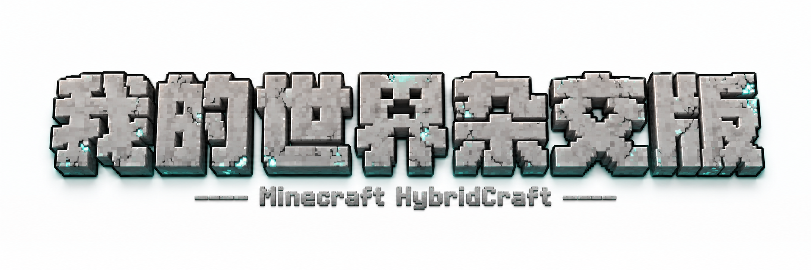
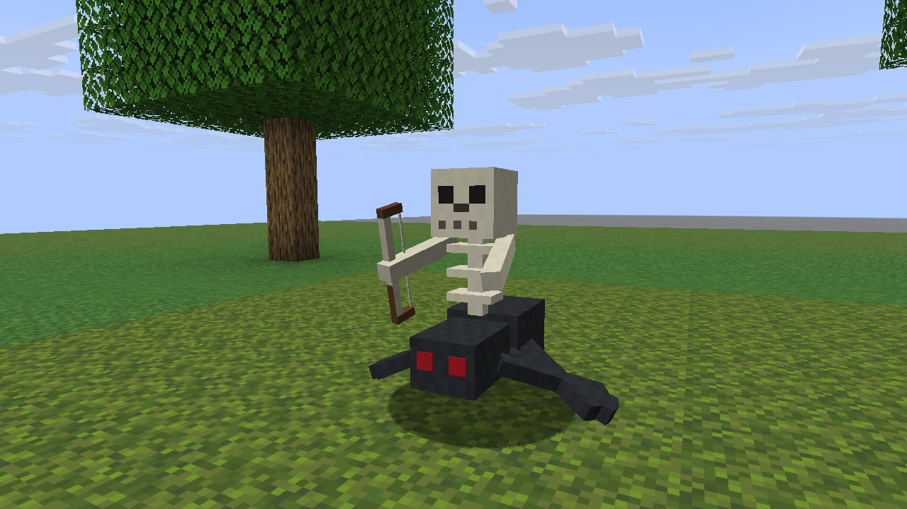
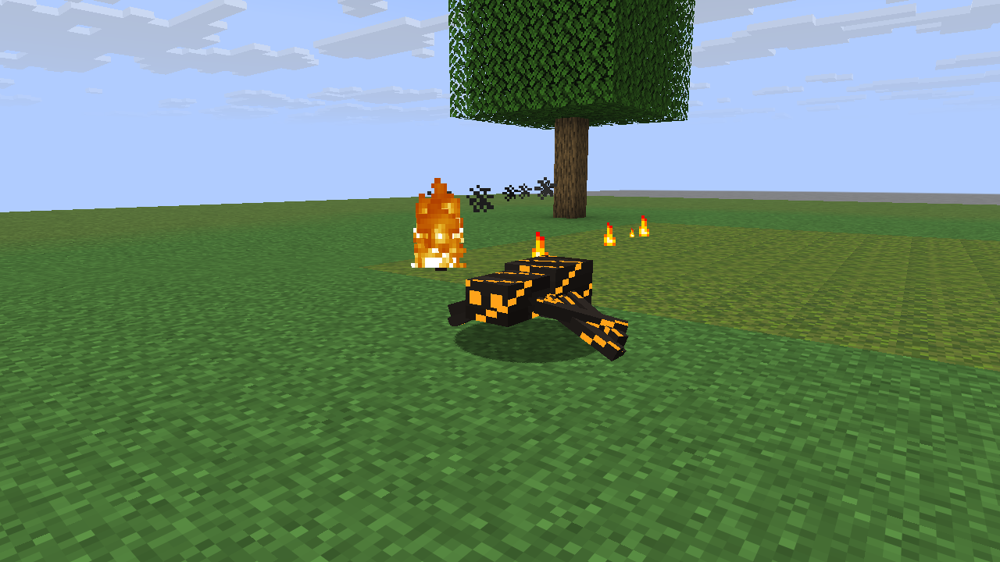
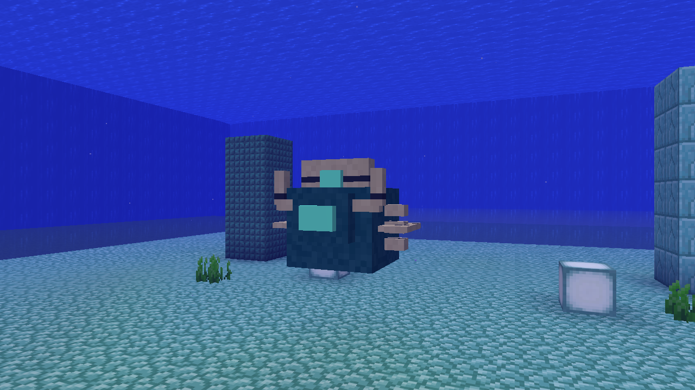
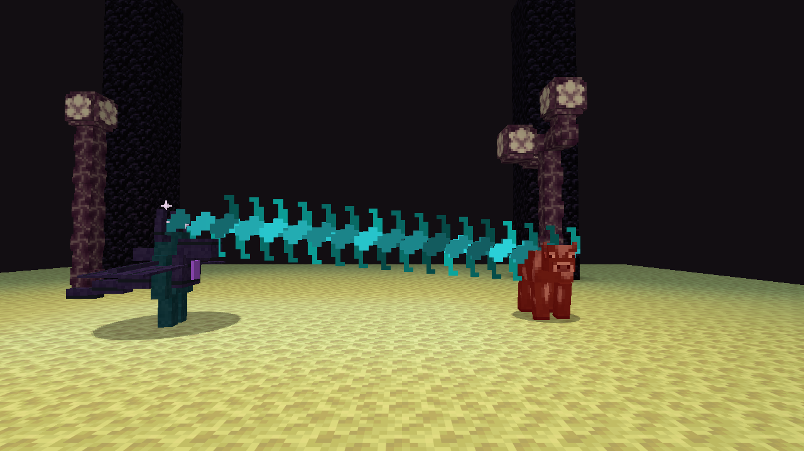
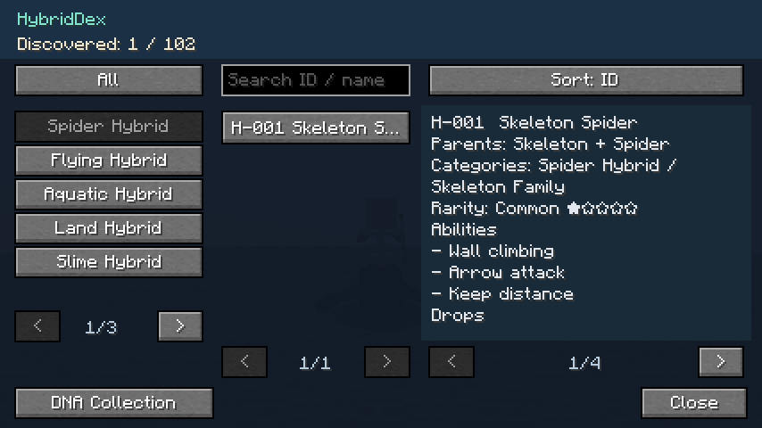
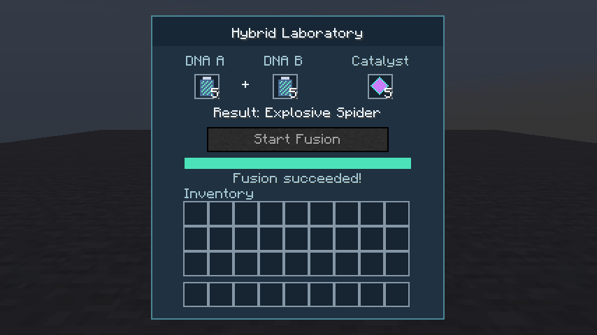

<div align="center">
<p><a href="README.md">English</a> | 简体中文</p>

<h1>HybridCraft</h1>
<p><strong>Minecraft 杂交世界</strong></p>
<p>熟悉的生物，意想不到的组合，等待探索的新世界。</p>
<p>
<code>Minecraft 26.1.2</code> <code>Fabric 0.19.3</code> <code>Java 25</code><br>
<code>HybridCraft 1.0.0-rc.1</code> <code>MIT License</code>
</p>
<p><a href="#获取与安装">获取候选版与安装</a> · <a href="#hybriddex-图鉴">了解游戏内 HybridDex 图鉴</a> · <a href="CHANGELOG.md">更新日志</a></p>
</div>

HybridCraft 是一个 **Minecraft Java Edition Fabric 模组**，将原版生物的外形、移动方式、攻击方式与特殊能力融为新的杂交生物。在具有区域生态、发现记录与 DNA 融合玩法的世界中，探索 **100+ 杂交生物——当前共 102 种，编号 H-001–H-102**。

**公开状态：** 已测试的 v1.0.0 发布候选版以 **HybridCraft-1.0.0.jar** 提供下载，内部版本仍为 **1.0.0-rc.1+mc26.1.2**。尚未创建 GitHub Release 或 Tag。

## 核心特色

- **🧬 100+ 杂交生物**——父代特征组成独特的轮廓与战斗方式，从攀墙射手到飞行爆破者，各有特点。
- **🌍 Hybrid World 生态**——生物群系、维度、稀有度与世界杂交等级共同影响自然遭遇，原版生物仍然存在。
- **⚔ 杂交能力系统**——攀爬、飞行、瞬移、投射物、冲锋等能力组合使用，并设有冷却与数量限制。
- **📖 HybridDex 图鉴**——发现生物、记录个人探索进度，通过搜索、分类与排序查看父代、能力、掉落和栖息地。
- **🧪 DNA 融合系统**——收集 DNA，按照确定的父代组合，通过 102 个融合配方获得指定 Hybrid。
- **🔬 杂交实验台**——在专用界面中放入两份 DNA 与催化剂，查看融合进度和结果。

## 杂交世界怎么玩

| 父代组合 | 杂交结果 |
|---|---|
| 骷髅 + 蜘蛛 | H-001 骸骨蛛 |
| 蜜蜂 + 苦力怕 | H-006 爆蜂 |
| 末影人 + 潜影贝 | H-019 末影甲壳 |

探索世界 → 遭遇 Hybrid → 解锁图鉴条目 → 收集 DNA → 尝试融合。

Hybrid 也会自然出现。系统依据生物群系与维度规则，让符合条件的原版敌对生物生成候选按概率发生变异，同时遵守原版刷怪上限。主世界、下界与末地拥有不同的生物组合，河流和海洋也有水生 Hybrid；稀有与传奇生物采用受限制的低概率生成规则。

## 代表生物

| Hybrid | 父代 | 核心能力 |
|---|---|---|
| H-001 骸骨蛛<br>Skeleton Spider | 骷髅 + 蜘蛛 | 攀墙、射箭、保持距离 |
| H-004 烈焰蛛<br>Blaze Spider | 蜘蛛 + 烈焰人 | 攀墙、火球、火焰免疫 |
| H-006 爆蜂<br>Explosive Bee | 蜜蜂 + 苦力怕 | 飞行、引信爆炸 |
| H-007 深海尸卫<br>Drowned Guardian | 溺尸 + 守卫者 | 游泳、蓄力激光、近战 |
| H-018 浮空潜影兽<br>Floating Shulker Beast | 幻翼 + 潜影贝 | 飞行、追踪弹、短暂漂浮 |
| H-026 远古铁兽<br>Ancient Iron Beast | 铁傀儡 + 劫掠兽 | 重型近战、预警冲锋、击退 |
| H-097 深渊古王<br>Abyssal Sovereign | 监守者 + 远古守卫者 | 游泳、声波与激光、短暂抗性 |
| H-100 幽匿龙王<br>Sculkwing Sovereign | 监守者 + 末影龙 | 飞行、声波与激光、短暂黑暗 |

## 实机截图

以下均为当前候选版的 Minecraft 实际运行画面。生物场景在独立测试世界中布置，战斗效果来自现有 AI；水下场景用于展示栖息环境，并非自然遭遇记录。中英文首页使用同一组图片，下方界面截图为英文界面。

<table>
<tr>
<td width="50%"><br><strong>骸骨蛛</strong>——蜘蛛身体与骷髅上半身融合。</td>
<td width="50%"><br><strong>烈焰蛛</strong>——实际飞行中的火球。</td>
</tr>
<tr>
<td width="50%"><br><strong>深渊古王</strong>——水生栖息环境展示。</td>
<td width="50%"><br><strong>幽匿龙王</strong>——末地中的声波攻击。</td>
</tr>
<tr>
<td width="50%"><br><strong>HybridDex</strong>——发现记录、分类与生物详情。</td>
<td width="50%"><br><strong>杂交实验台</strong>——完成一次 DNA 融合。</td>
</tr>
</table>

## HybridDex 图鉴

**游戏内按 H 打开完整 HybridDex 图鉴。**

游戏内图鉴覆盖 **102 个条目，编号 H-001–H-102**，包含父代、能力、掉落、栖息地与融合配方；发现生物后即可查看对应记录。为保持发布仓库精简，独立图鉴文档与完整截图素材库未包含在本仓库中。

游戏内默认按 **H** 打开个人图鉴。靠近视线中的 Hybrid 可解锁对应条目，再通过搜索、分类和排序整理发现记录。界面支持简体中文与英文。

## DNA 融合

原版生物 → DNA 样本 → 两种父代 DNA + 杂交催化剂 → 杂交实验台 → Hybrid 生物。

1. 从符合条件的原版生物掉落中收集 DNA，在图鉴中选择父代组合。
2. 将两种父代 DNA 和一个杂交催化剂放入实验台，启动融合；DNA 槽位顺序不限。
3. 发起者保持实验台界面打开，融合才会继续。当前配方需要 **600 个有效 tick（正常 TPS 下为 30 秒）**，**成功率为 90%**。

实验台周围要为产物留出合适空间：陆生生物需要地面，飞行生物需要空域，水生生物需要足够水域。放置受阻时会保留已经完成的结果，之后可以重试。融合产生的生物仍保留敌对行为。

## 获取与安装

从本仓库下载已经测试的构建。公开文件名为 `HybridCraft-1.0.0.jar`，内部版本仍是 `1.0.0-rc.1+mc26.1.2`；文件改名没有改变 JAR 内容。

- **[下载 HybridCraft-1.0.0.jar](HybridCraft-1.0.0.jar?raw=true)**
- [Fabric Loader 安装器](https://fabricmc.net/use/installer/)
- [Fabric API 下载页面](https://modrinth.com/mod/fabric-api)——请选择 **0.155.3+26.1.2**。

Fabric Loader 与 Fabric API 需要自行安装。本仓库不附带启动器、Minecraft 实例或其他模组。GitHub Release 和 Tag 将在仓库页面审核后另行创建。

1. 创建 **Minecraft Java Edition 26.1.2** 实例，选择 **Java 25**。
2. 为该实例安装 **Fabric Loader 0.19.3**。
3. 将 **Fabric API 0.155.3+26.1.2** 放入实例的 `mods` 文件夹。
4. 将 HybridCraft 候选版 JAR 放入同一文件夹。只保留一个 HybridCraft 版本，使用可运行 JAR，不要使用源码 JAR。
5. 启动游戏。在非和平难度下探索，或在创造模式中使用刷怪蛋查看生物。

可以使用 PCL 等兼容 Fabric 的启动器。开启版本隔离时，请使用该实例自己的 `mods` 文件夹。多人游戏需要在客户端与服务端同时安装 HybridCraft 和 Fabric API。

## 运行要求

| 组件 | 当前构建目标 |
|---|---|
| Minecraft Java Edition | 26.1.2 |
| Fabric Loader | 0.19.3 |
| Fabric API | 0.155.3+26.1.2 |
| Java | 25 |
| HybridCraft | 1.0.0-rc.1 |

JAR 内的完整模组版本为 `1.0.0-rc.1+mc26.1.2`。Minecraft 适配范围为 **26.1.2**，更高游戏版本需要另行测试。

## 开发路线

| 阶段 | 里程碑 | 状态 |
|---|---|---|
| Phase 1 | 实体原型 | ✅ 已完成 |
| Phase 2 | Trait / 能力框架 | ✅ 已完成 |
| Phase 3 | 跨生态杂交生物 | ✅ 已完成 |
| Phase 4 | 生物内容扩展 | ✅ 已完成 |
| Phase 5 | Hybrid World 生态 | ✅ 已完成 |
| Phase 6 | HybridDex 与发现系统 | ✅ 已完成 |
| Phase 7 | DNA 融合与实验台 | ✅ 已完成 |
| Phase 8 | 100+ Hybrid 发布候选版 | ✅ 已完成 |
| 发布准备 | 首页展示、人工审核与发布检查 | 🚧 进行中 |
| Phase 9 | GitHub 仓库公开上线 | ✅ 已完成 |

后续继续完善生存平衡、模型动画、多人压力测试，以及经过明确测试的版本兼容。

## 技术概览

项目使用 Java 与 Fabric，以数据驱动的 `HybridDefinition` 元数据、可复用 Trait 和 JSON 融合配方组织内容，串联生物目录、自然生成、发现记录与实验台玩法。

这里是精简的模组发布仓库。源码、Gradle 工程、开发工具与完整截图素材库均保留在开发项目中，不包含在本仓库内。

```text
README.md                英文首页
README_zh-CN.md           简体中文首页
HybridCraft-1.0.0.jar     可运行模组（内部版本：1.0.0-rc.1+mc26.1.2）
readme-assets/           两张 Banner 与六张精选实机截图
CHANGELOG.md             版本记录
LICENSE                  MIT 开源协议
.gitignore               开发文件与私密文件排除规则
```

## 参与贡献

欢迎提供问题反馈、平衡建议、翻译、模型与代码改进。反馈问题时，请附上 Minecraft 和模组版本、复现步骤及相关日志。新增生物设计请沿用现有父代、能力组合与融合体系。

## 开源协议

HybridCraft 代码与项目自有资源采用 [MIT License](LICENSE)。Minecraft 与 Fabric 属于各自权利人的项目，本项目不附带 Minecraft 游戏文件。
